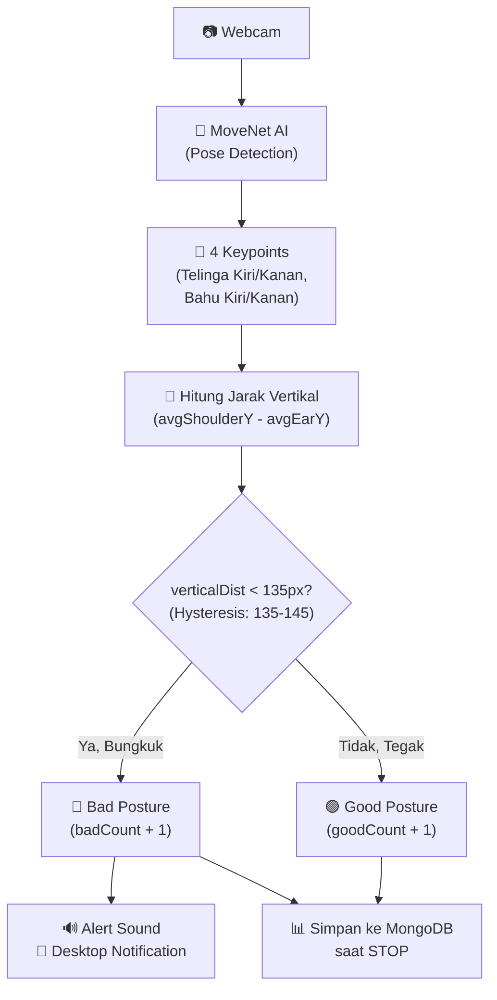
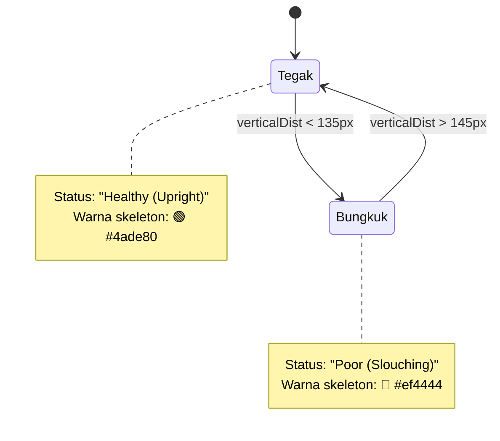
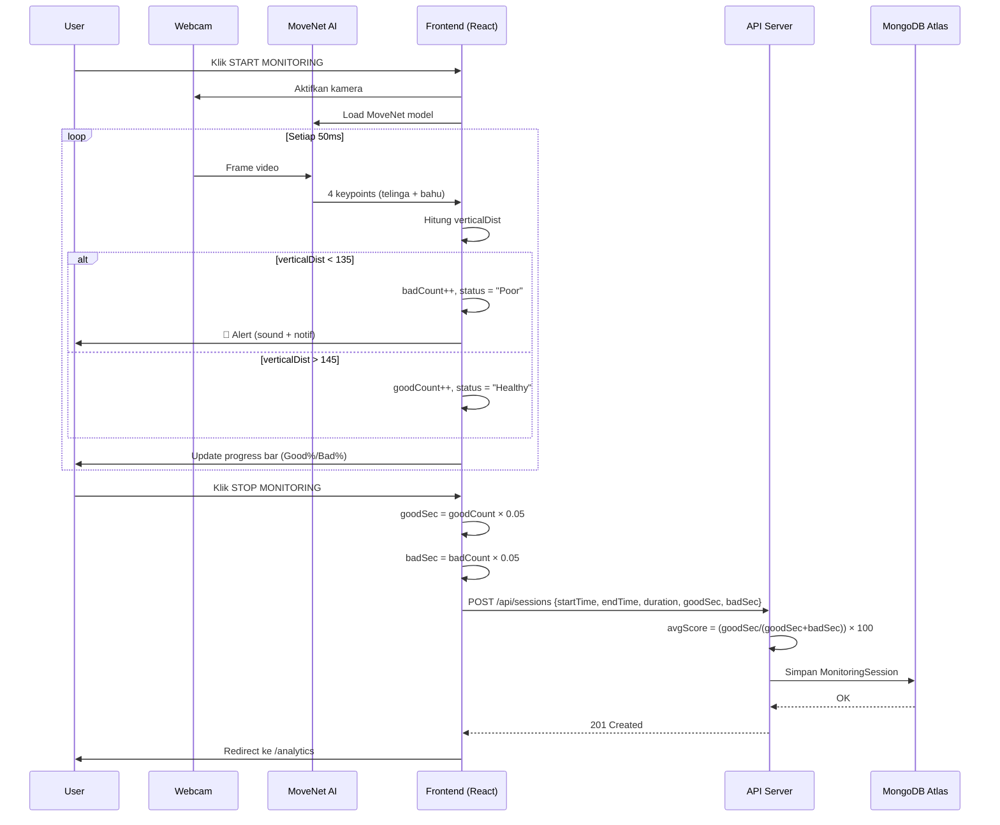

# 📖 Penjelasan Lengkap Sistem Monitoring VisionGuard AI

## 1. Gambaran Umum Sistem

VisionGuard AI adalah sistem monitoring postur tubuh berbasis web yang menggunakan **AI pose estimation** (TensorFlow.js + MoveNet) untuk mendeteksi apakah pengguna sedang **membungkuk (slouching)** atau **duduk tegak (upright)** secara real-time melalui webcam.



---

## 2. Teknologi yang Digunakan

| Komponen | Teknologi |
|----------|-----------|
| AI Model | TensorFlow.js + **MoveNet SINGLEPOSE_LIGHTNING** |
| Frontend | Next.js (React) |
| State Management | Zustand (persist ke localStorage) |
| Database | MongoDB Atlas (via Prisma ORM) |
| Auth | NextAuth.js |
| Chart | Chart.js (react-chartjs-2) |

---

## 3. Cara Kerja Deteksi Postur (Core Algorithm)

> Source: [monitoring/page.js](file:///d:/PPL/visionguard-ai/src/app/monitoring/page.js)

### 3.1 Keypoints yang Digunakan

MoveNet mendeteksi 17 titik tubuh, namun VisionGuard hanya menggunakan **4 keypoints**:

| Keypoint | Nama di Kode | Fungsi |
|----------|-------------|--------|
| `left_ear` | `lEar` | Posisi telinga kiri (representasi kepala) |
| `right_ear` | `rEar` | Posisi telinga kanan (representasi kepala) |
| `left_shoulder` | `lShoulder` | Posisi bahu kiri |
| `right_shoulder` | `rShoulder` | Posisi bahu kanan |

> [!NOTE]
> Setiap keypoint memiliki properti `x`, `y` (koordinat piksel di video), dan `score` (confidence 0-1). Keypoint hanya dianggap valid jika `score > 0.3`.

### 3.2 Rumus Perhitungan Jarak Vertikal

Ini adalah **rumus inti** yang menentukan apakah pengguna membungkuk atau tidak:

```
avgEarY       = (lEar.y + rEar.y) / 2
avgShoulderY  = (lShoulder.y + rShoulder.y) / 2
verticalDist  = Math.round(avgShoulderY - avgEarY)
```

**Penjelasan:**
- `avgEarY` = rata-rata posisi Y (vertikal) kedua telinga → mewakili **posisi kepala**
- `avgShoulderY` = rata-rata posisi Y kedua bahu → mewakili **posisi bahu**
- `verticalDist` = jarak vertikal antara bahu dan telinga dalam **piksel**

> [!IMPORTANT]
> Dalam koordinat layar, **Y bertambah ke bawah**. Jadi bahu (yang lebih rendah di tubuh) memiliki `Y` lebih besar dari telinga. Saat membungkuk, kepala turun mendekati bahu → jarak **mengecil**.

**Contoh Visual:**

```
Tegak (verticalDist ≈ 160px):        Membungkuk (verticalDist ≈ 110px):
    👂 Y=100                              👂 Y=180
    |                                      \
    |  jarak = 260-100 = 160px              \ jarak = 290-180 = 110px  
    |                                        \
    🤷 Y=260                               🤷 Y=290
```

### 3.3 Mekanisme Hysteresis (Anti-Flicker)

Untuk mencegah status berkedip-kedip (*flickering*) saat `verticalDist` berada di ambang batas, digunakan **dua threshold**:

```javascript
// Dari monitoring/page.js baris 137-141
if (verticalDist < 135) {
    isSlouchingNow = true;      // PASTI bungkuk
} else if (verticalDist > 145) {
    isSlouchingNow = false;     // PASTI tegak
}
// Jika 135 ≤ verticalDist ≤ 145 → tetap di status sebelumnya
```



> [!TIP]
> **Dead zone 135-145px**: Jika saat ini "Tegak" dan jarak turun ke 140px, masih dianggap tegak. Baru berubah jadi bungkuk kalau turun di bawah 135px. Begitu pula sebaliknya.

---

## 4. Interval Deteksi & Konversi Frame ke Detik

### 4.1 Loop Deteksi

```javascript
// monitoring/page.js baris 172-175
if (window.runDetection) {
    setTimeout(detectFrame, 50);  // Setiap 50ms = 20 FPS
}
```

Setiap **50 milidetik** (≈ 20 frame per detik), fungsi `detectFrame()` dipanggil dan:
- Jika **bungkuk** → `badCount += 1`
- Jika **tegak** → `goodCount += 1`

### 4.2 Konversi Frame Count → Detik

Saat user menekan **STOP MONITORING**, frame count dikonversi ke detik:

```javascript
// monitoring/page.js baris 212-214
const goodSec = Math.round(goodCount * 0.05);  // frame × 0.05s
const badSec  = Math.round(badCount * 0.05);   // frame × 0.05s
```

**Rumus:**

```
Detik = FrameCount × Interval(detik)
      = FrameCount × 0.05

Contoh:
  goodCount = 2400 frame → 2400 × 0.05 = 120 detik (2 menit)
  badCount  = 600  frame → 600  × 0.05 = 30 detik
```

### 4.3 Durasi Sesi

```javascript
// monitoring/page.js baris 209-210
const endTime = new Date();
const durationSeconds = Math.floor((endTime - new Date(startTime)) / 1000);
```

```
duration = (waktuStop - waktuStart) / 1000   (dalam detik)
```

> [!NOTE]
> `duration` dihitung dari **waktu jam nyata** (wall clock), sedangkan `goodSec + badSec` dihitung dari **jumlah frame yang terdeteksi**. Keduanya bisa sedikit berbeda karena frame yang tidak mendeteksi pose (keypoint tidak terlihat) tidak dihitung.

---

## 5. Persentase Real-Time (Ditampilkan Saat Monitoring)

Selama monitoring berjalan, progress bar menampilkan persentase secara live:

```javascript
// monitoring/page.js baris 315-317
const total = goodCount + badCount || 1;  // Hindari bagi 0
const goodPercent = Math.round((goodCount / total) * 100);
const badPercent  = Math.round((badCount / total) * 100);
```

**Rumus:**

```
                    goodCount
Good% = round( ─────────────────── × 100 )
                goodCount + badCount

                    badCount
Bad%  = round( ─────────────────── × 100 )
                goodCount + badCount
```

**Contoh:**
```
goodCount = 1800, badCount = 200
total = 2000
Good% = round(1800/2000 × 100) = 90%
Bad%  = round(200/2000 × 100)  = 10%
```

---

## 6. Avg Score (Dihitung di Server/API)

Ketika sesi disimpan, **Avg Score** dihitung di server API:

```javascript
// api/sessions/route.js baris 59-60
const total = goodPostureSeconds + badPostureSeconds;
const avgScore = total > 0 ? (goodPostureSeconds / total) * 100 : 0;
```

**Rumus:**

```
                      goodPostureSeconds
avgScore = ────────────────────────────────────── × 100
           goodPostureSeconds + badPostureSeconds
```

> [!IMPORTANT]
> **avgScore = Good%** — Ini pada dasarnya adalah persentase waktu pengguna duduk dengan postur baik. Disimpan sebagai `Float` di database dengan 2 desimal (`avgScore.toFixed(2)`).

**Contoh:**
```
goodPostureSeconds = 120, badPostureSeconds = 30
total = 150
avgScore = (120/150) × 100 = 80.00%
```

**Interpretasi Score di halaman Analytics:**

| Score | Label | Warna |
|-------|-------|-------|
| ≥ 80% | Excellent / Good | 🟢 Hijau |
| 50-79% | Average | 🟡 Kuning |
| < 50% | Needs Improvement / Bad | 🔴 Merah |

---

## 7. Data yang Disimpan ke Database (MongoDB)

### 7.1 Struktur Data `MonitoringSession`

Ketika user klik **STOP**, data dikirim via `POST /api/sessions`:

```json
{
  "startTime": "2026-06-30T12:00:00.000Z",
  "endTime": "2026-06-30T12:15:00.000Z",
  "duration": 900,
  "goodPostureSeconds": 720,
  "badPostureSeconds": 180
}
```

Server menambahkan field yang dihitung:

| Field | Tipe | Sumber | Keterangan |
|-------|------|--------|------------|
| `id` | String (ObjectId) | Auto-generated | ID unik MongoDB |
| `userId` | String (ObjectId) | Server Session | ID user yang login |
| `startTime` | DateTime | Client `Date.now()` saat klik START | Waktu mulai monitoring |
| `endTime` | DateTime | Client `new Date()` saat klik STOP | Waktu selesai monitoring |
| `duration` | Int | `(endTime - startTime) / 1000` | Total durasi dalam **detik** |
| `goodPostureSeconds` | Int | `goodCount × 0.05` | Detik postur bagus |
| `badPostureSeconds` | Int | `badCount × 0.05` | Detik postur buruk |
| `avgScore` | Float | `(good/(good+bad)) × 100` | **Dihitung di server**, bukan dari client |

---

## 8. Sistem Alert (Peringatan)

### 8.1 Sound Alert

```javascript
// monitoring/page.js baris 148-159
const now = Date.now();
const cooldownMs = (cooldown || 5) * 1000;

if (now - lastAlertTimeRef.current >= cooldownMs) {
    if (soundAlert) playAlertSound();    // Bunyi "beep" 800Hz
    lastAlertTimeRef.current = now;
}
```

**Mekanisme:**
- Suara beep sinusoidal **800Hz** selama **300ms**
- Menggunakan **Web Audio API** (bukan file audio)
- Ada **cooldown** agar tidak beep terus-menerus (default 3-5 detik)
- Cooldown bisa diatur di halaman Settings (0-10 detik)

### 8.2 Desktop Notification

```
Hanya ditampilkan SEKALI saat transisi Tegak → Bungkuk
(tidak diulang selama masih bungkuk)
```

### 8.3 Visual Warning

Saat bungkuk terdeteksi, muncul banner merah **"⚠️ BUNGKUK DETECTED"** dengan animasi bounce di atas video feed.

---

## 9. Alur Data End-to-End



---

## 10. Halaman-Halaman dan Data yang Ditampilkan

### 10.1 Dashboard ([/dashboard](file:///d:/PPL/visionguard-ai/src/app/dashboard/page.js))
- Halaman landing dengan **stat cards statis** (Health 71%, Streak 7 days, Score 92%)
- Tombol **Start Monitoring**

> [!WARNING]
> Stat cards di Dashboard saat ini menggunakan **nilai hardcoded** (tidak dari database). Ini hanyalah placeholder UI.

### 10.2 Monitoring ([/monitoring](file:///d:/PPL/visionguard-ai/src/app/monitoring/page.js))
- **Live video feed** dengan skeleton overlay
- **Status real-time**: "Healthy (Upright)" / "Poor (Slouching)"
- **Jarak vertikal** dalam piksel
- **Progress bar** Good% vs Slouch% (dihitung per-frame)

### 10.3 Analytics ([/analytics](file:///d:/PPL/visionguard-ai/src/app/analytics/page.js))
Data yang ditampilkan (diambil dari `GET /api/sessions`):

| Elemen | Rumus/Sumber |
|--------|-------------|
| Durasi | `formatDuration(duration)` → mm:ss |
| Avg Score | `Math.round(avgScore)` → dari DB |
| Bad Posture | `badPostureSeconds` → dari DB |
| Total Sesi | `sessions.length` |
| Doughnut Chart | `Good% vs Bad%` dari sesi terakhir |
| Score Timeline | Line chart 10 sesi terakhir → `avgScore` per sesi |
| Good vs Bad Bar | Bar chart → `goodPostureSeconds` vs `badPostureSeconds` per sesi |
| Tabel Riwayat | Semua sesi dengan status label (Good/Average/Bad) |

### 10.4 History ([/history](file:///d:/PPL/visionguard-ai/src/app/history/page.js))
Data yang ditampilkan (diambil dari `GET /api/history`):

```javascript
const total = session.goodPostureSeconds + session.badPostureSeconds || 1;
const goodPercent = Math.round((session.goodPostureSeconds / total) * 100);
```

---

## 11. Ringkasan Semua Rumus

| # | Rumus | Lokasi | Keterangan |
|---|-------|--------|------------|
| 1 | `avgEarY = (lEar.y + rEar.y) / 2` | [monitoring L127](file:///d:/PPL/visionguard-ai/src/app/monitoring/page.js#L127) | Rata-rata posisi Y telinga |
| 2 | `avgShoulderY = (lShoulder.y + rShoulder.y) / 2` | [monitoring L127](file:///d:/PPL/visionguard-ai/src/app/monitoring/page.js#L127) | Rata-rata posisi Y bahu |
| 3 | `verticalDist = round(avgShoulderY - avgEarY)` | [monitoring L128](file:///d:/PPL/visionguard-ai/src/app/monitoring/page.js#L128) | Jarak vertikal bahu-telinga (px) |
| 4 | `isSlouching = verticalDist < 135` | [monitoring L137](file:///d:/PPL/visionguard-ai/src/app/monitoring/page.js#L137) | Threshold bungkuk (hysteresis bawah) |
| 5 | `isUpright = verticalDist > 145` | [monitoring L139](file:///d:/PPL/visionguard-ai/src/app/monitoring/page.js#L139) | Threshold tegak (hysteresis atas) |
| 6 | `goodSec = round(goodCount × 0.05)` | [monitoring L213](file:///d:/PPL/visionguard-ai/src/app/monitoring/page.js#L213) | Konversi frame ke detik |
| 7 | `badSec = round(badCount × 0.05)` | [monitoring L214](file:///d:/PPL/visionguard-ai/src/app/monitoring/page.js#L214) | Konversi frame ke detik |
| 8 | `duration = floor((endTime - startTime) / 1000)` | [monitoring L210](file:///d:/PPL/visionguard-ai/src/app/monitoring/page.js#L210) | Durasi wall-clock dalam detik |
| 9 | `Good% = round(goodCount / total × 100)` | [monitoring L316](file:///d:/PPL/visionguard-ai/src/app/monitoring/page.js#L316) | Persentase live (dari frame count) |
| 10 | `Bad% = round(badCount / total × 100)` | [monitoring L317](file:///d:/PPL/visionguard-ai/src/app/monitoring/page.js#L317) | Persentase live (dari frame count) |
| 11 | `avgScore = (goodSec / (goodSec + badSec)) × 100` | [sessions API L60](file:///d:/PPL/visionguard-ai/src/app/api/sessions/route.js#L60) | Score final, dihitung di server |
